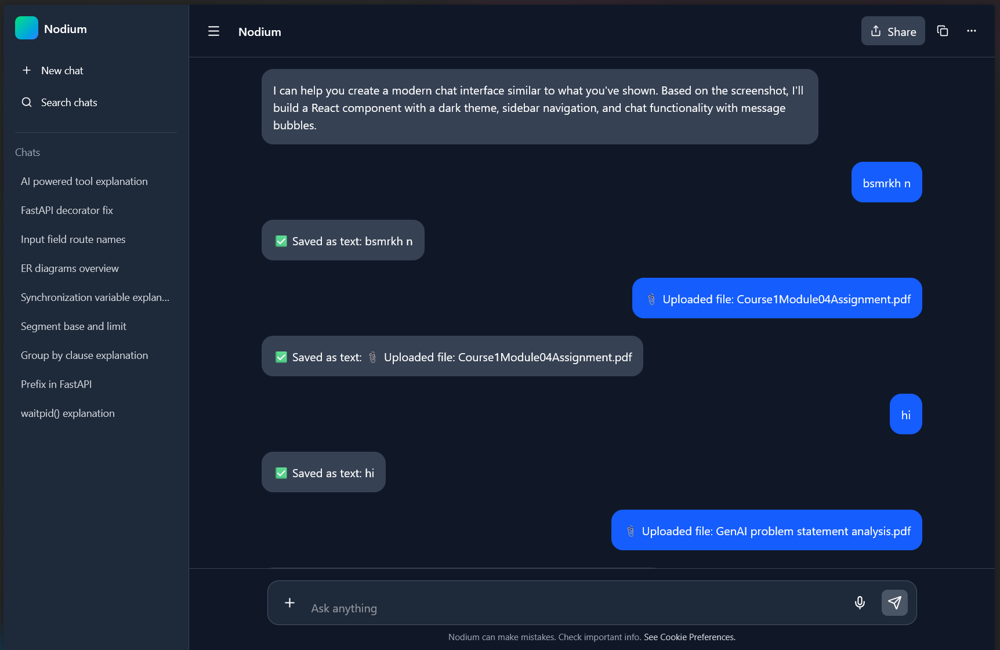

# 🛡️ AI-Powered Misinformation Detection & Education Tool

An AI-driven platform that **detects potential misinformation**, verifies claims using trusted sources, and **educates users** on identifying credible, trustworthy content.  

Built for the **Google Hackathon**, this project leverages **Google Vertex AI**, **Google Fact Check API**, and modern NLP techniques.

---

## ✨ Features

- 🔍 **Content Classification**  
  Detect whether content is **True / Fake / Biased / Spam**.

- 📖 **Claim Verification**  
  Use **Natural Language Inference (NLI)** + **fact-check retrieval** from Google Fact Check, Wikipedia, and news APIs.

- 🧠 **Explainability & Summarization**  
  Provide clear reasoning and educational insights to help users understand *why* content was flagged.

- 🌐 **User Interfaces**  
  - **Streamlit prototype** for quick demos.  
  - **React frontend** with Tailwind for production-ready UI.  

---

## 🏗️ Architecture (High Level)

1. **User Input** → Text, URL, image, or audio.  
2. **Preprocessing** → Clean text, extract claims.  
3. **Verification** → Retrieve trusted sources (Google Fact Check, Wikipedia, News APIs) and run **NLI** to check claim consistency.  
4. **Classification** → ML/Vertex AI model assigns label (**True / Fake / Biased / Spam**) using both raw input + verification evidence.  
5. **Summarization** → Generate explanation + media literacy tips.  
6. **Frontend Output** → Return results with labels, confidence scores, evidence, and education note.  

---

# Current Status

### Model frontend was created

### Now Can send input from frontend to backend and get response also 
#### Now only it handles text input other input files,images it cant recognise
#### Soon the feature will be added

# Instruction to use Git branch 

#### It was pushed on seprate branch feature/input

### WORK ON SPECIFIC BRANCH

#### For first time 
```bash
git clone https://github.com/Unknown-guy-369/GenAI_hackathon.git

```

#### Already cloned
```bash
git fetch orgin

git branch

git switch feature/input
```


